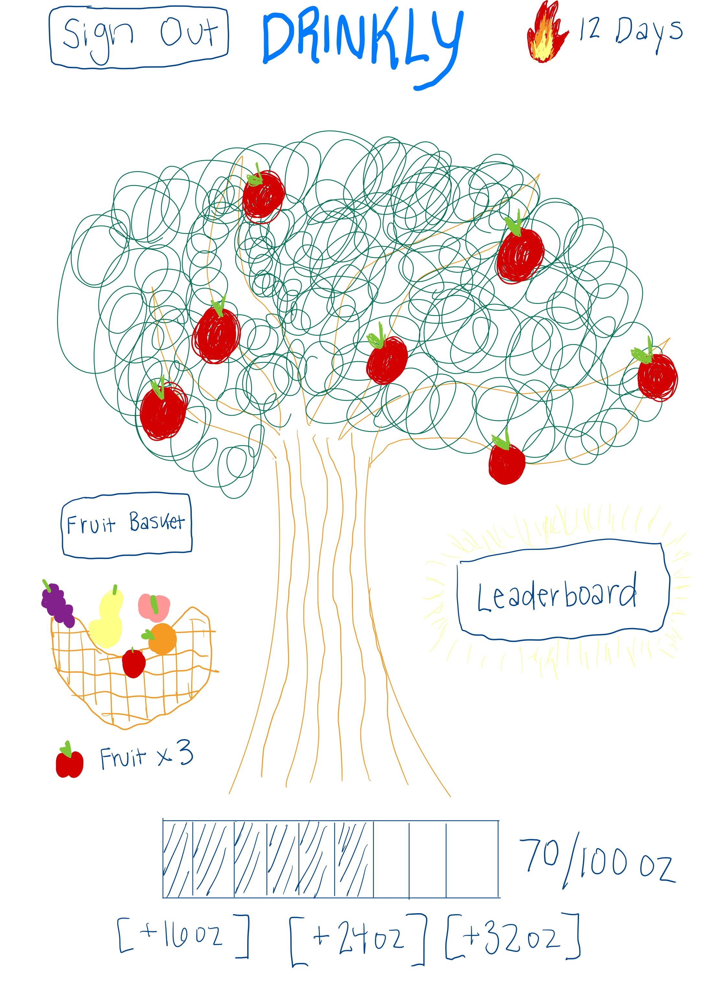
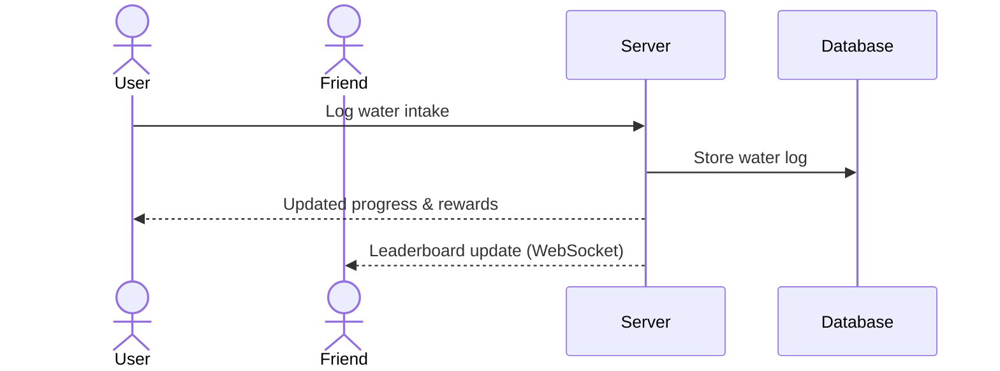

# Drinkly

[My Notes](docs/notes.md)

## 🚀 Specification Deliverable

<!-- > [!NOTE]
> Fill in this sections as the submission artifact for this deliverable. You can refer to this [example](https://github.com/webprogramming260/startup-example/blob/main/README.md) for inspiration. -->

For this deliverable I did the following. I checked the box `[x]` and added a description for things I completed.

- [ ] Proper use of Markdown
- [ ] A concise and compelling elevator pitch
- [ ] Description of key features
- [ ] Description of how you will use each technology
- [ ] One or more rough sketches of your application. Images must be embedded in this file using Markdown image references.

### Elevator pitch

Drinkly is a gamified water intake tracker that turns hydration into a daily streak game. Users log water with a single tap and watch their virtual tree grow with rain animations as they progress toward personalized hydration goals, earn fruit rewards for consistency, unlock new tree species, and compete with friends on a realtime leaderboard.

### Design

Here is a sequence diagram that shows how users interact with the backend when logging water and updating the leaderboard.

### Key features

- Secure user registration, login, and logout
- Personalized daily hydration goals
- One-tap water intake logging
- Animated tree growth and rain effects
- Streak tracking and fruit rewards
- Unlockable tree types based on consistency
- Weekly leaderboard
- Realtime updates using WebSockets
- Persistent storage of user and activity data
- Ability for admin to manage hydration facts

### Technologies

I am going to use the required technologies in the following ways.

- **HTML** – Uses correct HTML structure for application pages including login, profile setup, dashboard, fruit basket, leaderboard, settings, and admin views.
- **CSS** – Application styling that looks good on different screen sizes, uses good whitespace, color choice, contrast, and includes animations for tree growth and rain effects.
- **React** – Provides login, water logging, progress display, leaderboard viewing, and routing using React components and React Router.
- **Service** – Backend service with endpoints for:
  - register
  - login
  - logout
  - logging water intake
  - retrieving daily intake totals
  - retrieving leaderboard data
  - managing fruit rewards and tree unlocks
- **DB/Login** – Stores users, authentication credentials, water logs, streaks, fruit inventory, and unlocked trees in a database. Users must be authenticated to log water.
- **WebSocket** – As users log water or complete daily goals, leaderboard updates and friend activity are broadcast to all other users in realtime.
- **Third-party API** – When a user reaches their daily hydration goal, the backend retrieves a motivational quote from the ZenQuotes public API and displays it as a reward.

## 🚀 AWS deliverable

For this deliverable I did the following. I checked the box `[x]` and added a description for things I completed.

- [ ] **Server deployed and accessible with custom domain name** - [My server link](https://startup.drink-ly.com).

## 🚀 HTML deliverable

For this deliverable I did the following. I checked the box `[x]` and added a description for things I completed.

- [x] **HTML pages** - Four HTML pages: index.html (login), dashboard.html (main app), leaderboard.html (weekly rankings), about.html (app info).
- [x] **Proper HTML element usage** - Used semantic elements: header, nav, main, footer, form, input, button, table, img, svg, meter, label.
- [x] **Links** - Navigation links between all pages.
- [x] **Text** - Descriptive text on each page explaining Drinkly's features.
- [x] **3rd party API placeholder** - Inspirational quote on about page for future API integration.
- [x] **Images** - Placeholder image of a hydration tree on about page.
- [x] **Login placeholder** - Login form with email/password inputs and login/create buttons.
- [x] **DB data placeholder** - Leaderboard table with sample user hydration data.
- [x] **WebSocket placeholder** - Notifications list showing friend activities on dashboard.

For this deliverable I did the following. I checked the box `[x]` and added a description for things I completed.

- [ ] **HTML pages** - Four HTML pages: index.html (login), dashboard.html (main app), leaderboard.html (weekly rankings), about.html (app info).
- [ ] **Proper HTML element usage** - Used semantic elements: header, nav, main, footer, form, input, button, table, img, svg, meter, label.
- [ ] **Links** - Navigation links between all pages.
- [ ] **Text** - Descriptive text on each page explaining Drinkly's features.
- [ ] **3rd party API placeholder** - Inspirational quote on about page for future API integration.
- [ ] **Images** - SVG placeholder for hydration tree on about page.
- [ ] **Login placeholder** - Login form with email/password inputs and login/create buttons; user name display on dashboard.
- [ ] **DB data placeholder** - Leaderboard table with sample user hydration data.
- [ ] **WebSocket placeholder** - Notifications list showing friend activities on dashboard.

## 🚀 CSS deliverable

For this deliverable I did the following. I checked the box `[x]` and added a description for things I completed.

- [ ] **Visually appealing colors and layout. No overflowing elements.** - I did not complete this part of the deliverable.
- [ ] **Use of a CSS framework** - I did not complete this part of the deliverable.
- [ ] **All visual elements styled using CSS** - I did not complete this part of the deliverable.
- [ ] **Responsive to window resizing using flexbox and/or grid display** - I did not complete this part of the deliverable.
- [ ] **Use of a imported font** - I did not complete this part of the deliverable.
- [ ] **Use of different types of selectors including element, class, ID, and pseudo selectors** - I did not complete this part of the deliverable.

## 🚀 React part 1: Routing deliverable

For this deliverable I did the following. I checked the box `[x]` and added a description for things I completed.

- [ ] **Bundled using Vite** - I did not complete this part of the deliverable.
- [ ] **Components** - I did not complete this part of the deliverable.
- [ ] **Router** - I did not complete this part of the deliverable.

## 🚀 React part 2: Reactivity deliverable

For this deliverable I did the following. I checked the box `[x]` and added a description for things I completed.

- [ ] **All functionality implemented or mocked out** - I did not complete this part of the deliverable.
- [ ] **Hooks** - I did not complete this part of the deliverable.

## 🚀 Service deliverable

For this deliverable I did the following. I checked the box `[x]` and added a description for things I completed.

- [ ] **Node.js/Express HTTP service** - I did not complete this part of the deliverable.
- [ ] **Static middleware for frontend** - I did not complete this part of the deliverable.
- [ ] **Calls to third party endpoints** - I did not complete this part of the deliverable.
- [ ] **Backend service endpoints** - I did not complete this part of the deliverable.
- [ ] **Frontend calls service endpoints** - I did not complete this part of the deliverable.
- [ ] **Supports registration, login, logout, and restricted endpoint** - I did not complete this part of the deliverable.

## 🚀 DB deliverable

For this deliverable I did the following. I checked the box `[x]` and added a description for things I completed.

- [ ] **Stores data in MongoDB** - I did not complete this part of the deliverable.
- [ ] **Stores credentials in MongoDB** - I did not complete this part of the deliverable.

## 🚀 WebSocket deliverable

For this deliverable I did the following. I checked the box `[x]` and added a description for things I completed.

- [ ] **Backend listens for WebSocket connection** - I did not complete this part of the deliverable.
- [ ] **Frontend makes WebSocket connection** - I did not complete this part of the deliverable.
- [ ] **Data sent over WebSocket connection** - I did not complete this part of the deliverable.
- [ ] **WebSocket data displayed** - I did not complete this part of the deliverable.
- [ ] **Application is fully functional** - I did not complete this part of the deliverable. --> -->
