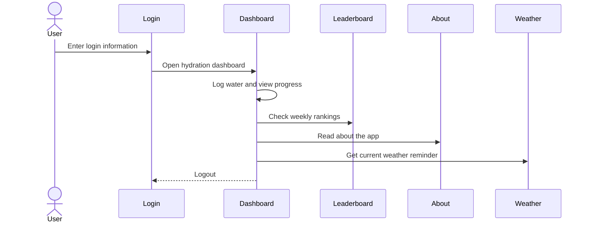

# Drinkly

[My Notes](notes.md)

Drinkly is a simple hydration tracker where users log water, build streaks, grow a virtual tree, and compare progress on a leaderboard.

I used the Simon projects as the baseline example for how to organize the app and how to describe each deliverable. The goal was to keep the same overall structure, but adapt it to my own startup idea.

## &#128640; Specification Deliverable

Drinkly helps users keep track of water intake in a way that feels more like a game. As users drink more water they increase their streak, improve their stats, and grow a tree on the dashboard.

For this deliverable I did the following. I checked the box `[x]` and added a description for things I completed.

- [x] Proper use of Markdown
- [x] A concise and compelling elevator pitch
- [x] Description of key features
- [x] Description of how you will use each technology
- [x] One or more rough sketches of your application. Images must be embedded in this file using Markdown image references.

### Elevator pitch

Staying hydrated is important, but easy to forget. Drinkly makes it more fun by turning water tracking into a daily streak game with progress, rewards, and a leaderboard.

### Design

```mermaid
sequenceDiagram
    actor User
    User->>Login: Enter login information
    Login->>Dashboard: Open hydration dashboard
    Dashboard->>Dashboard: Log water and view progress
    Dashboard->>Leaderboard: Check weekly rankings
    Dashboard->>About: Read about the app
    Dashboard->>Weather: Get current weather reminder
    Dashboard-->>Login: Logout
```

### Key features

- Login, logout, and register
- Log water intake
- See hydration progress and streaks
- View a leaderboard
- See a weather reminder
- Read about the app

### Technologies

I am going to use the required technologies in the following ways.

- **HTML** - Four different views, login/register controls, dashboard, leaderboard, and about.
- **CSS** - Blue color scheme, responsive layout, and styling for cards, buttons, and progress bars.
- **React** - Single page application with routing between views, reactive user controls, and state hooks.
- **Service** - Endpoints for authentication, saving hydration data, loading hydration data, and getting leaderboard data. Third party call for weather.
- **DB/Login** - Stores users and hydration data. Passwords are hashed and protected endpoints require authentication.
- **WebSocket** - When a user logs water on the dashboard, a real-time event is sent over WebSocket to the server, which forwards it to all other connected users. The leaderboard Live Activity feed displays these events instantly.

## &#128640; AWS deliverable

For this deliverable I did the following. I checked the box `[x]` and added a description for things I completed.

- [x] **Server deployed and accessible with custom domain name** - [My server link](https://startup.drink-ly.com).

## &#128640; HTML deliverable

For this deliverable I did the following. I checked the box `[x]` and added a description for things I completed.

- [x] **HTML pages** - Four different pages. One for each main view.
- [x] **Proper HTML element usage** - I used header, footer, main, nav, form, input, button, table, and image elements.
- [x] **Links** - Links between views.
- [x] **Text** - About page has text describing the app.
- [x] **3rd party API placeholder** - Added a placeholder area for outside data.
- [x] **Images** - Added images and placeholders for the hydration tree.
- [x] **Login placeholder** - Placeholder for auth on the login page.
- [x] **DB data placeholder** - Leaderboard data displayed on the leaderboard page.
- [x] **WebSocket placeholder** - Added placeholder friend activity.

## &#128640; CSS deliverable

For this deliverable I did the following. I checked the box `[x]` and added a description for things I completed.

- [x] **Header, footer, and main content body** - I styled the shared layout so it feels like one app.
- [x] **Navigation elements** - I used Bootstrap navigation and custom styles.
- [x] **Responsive to window resizing** - I used flexbox, grid, and media queries.
- [x] **Application elements** - I styled cards, forms, buttons, tables, and progress bars.
- [x] **Application text content** - I used a Google font and kept the text readable.
- [x] **Application images** - I added styling for the tree and dashboard images.

## &#128640; React part 1: Routing deliverable

For this deliverable I did the following. I checked the box `[x]` and added a description for things I completed.

- [x] **Bundled using Vite** - Easy to install and use Vite.
- [x] **Components** - I created separate React components for Login, Dashboard, Leaderboard, and About.
- [x] **Router** - I used React Router to switch between the views without reloading the page.

## &#128640; React part 2: Reactivity deliverable

For this deliverable I did the following. I checked the box `[x]` and added a description for things I completed.

- [x] **All functionality implemented or mocked out** - I used state for hydration data and mocked friend activity so the app feels interactive.
- [x] **Hooks** - I used `useState` and `useEffect` to load data and update the UI.

## &#128640; Service deliverable

For this deliverable I did the following. I checked the box `[x]` and added a description for things I completed.

- [x] **Node.js/Express HTTP service** - Installed Express with NPM and built the service in `service/index.js`. Default port is `4000`.
- [x] **Static middleware for frontend** - The service uses `express.static('public')`.
- [x] **Calls to third party endpoints** - The dashboard calls the Open-Meteo API and shows the weather in React.
- [x] **Backend service endpoints** - Added service endpoints in `service/index.js` for auth, hydration data, and leaderboard data.
- [x] **Frontend calls service endpoints** - Removed the local mock flow for login/data and replaced it with `fetch` calls to the service.
- [x] **Supports registration, login, logout, and restricted endpoint** - The app supports account creation, login, logout, and protected endpoints for hydration data and leaderboard data.
- [x] **Uses BCrypt to hash passwords** - Passwords are hashed with `bcryptjs` before being stored.

## &#128640; DB deliverable

For this deliverable I did the following. I checked the box `[x]` and added a description for things I completed.

- [x] **Stores data in MongoDB** - I store the hydration data (streak, intake, weekly total, last date, tree info) in MongoDB for each user so it persists.
- [x] **Stores credentials in MongoDB** - I store user accounts in MongoDB with a hashed password and auth token, and I use that to log in and protect endpoints.

## &#128640; WebSocket deliverable

For this deliverable I did the following. I checked the box `[x]` and added a description for things I completed.

- [x] **Backend listens for WebSocket connection** - Created `service/peerProxy.js` with a `DrinkProxy` function that attaches a `WebSocketServer` to the existing Express HTTP server. It listens for connections, forwards messages to all other connected clients, and uses ping/pong to keep connections alive.
- [x] **Frontend makes WebSocket connection** - Updated `src/leaderboard/drinkNotifier.js` to create a real WebSocket connection using the browser's built-in `WebSocket` API. It automatically uses `ws://` for http and `wss://` for https.
- [x] **Data sent over WebSocket connection** - When a user clicks `+ Log Water Intake` on the dashboard, `DrinkNotifier.sendEvent()` sends a JSON message over the WebSocket connection to the server, which forwards it to all other connected users.
- [x] **WebSocket data displayed** - The leaderboard's Live Activity feed displays real-time events from other users (e.g. `Maddy just logged 8 oz`) and connection status messages (e.g. `WebSocket connected`).
- [x] **Application is fully functional** - Tested with two browser windows logged in as different users. Logging water in one window instantly updates the Live Activity feed in the other window. No mocks or placeholder features remain.
