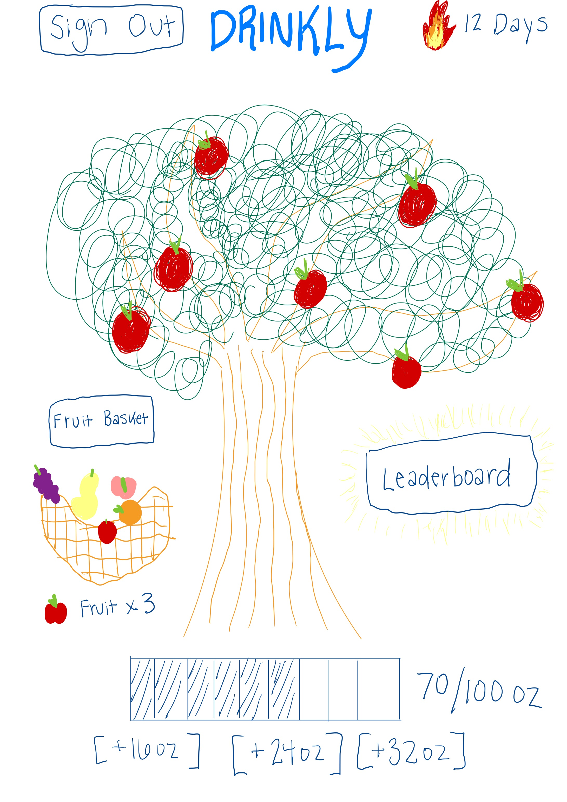
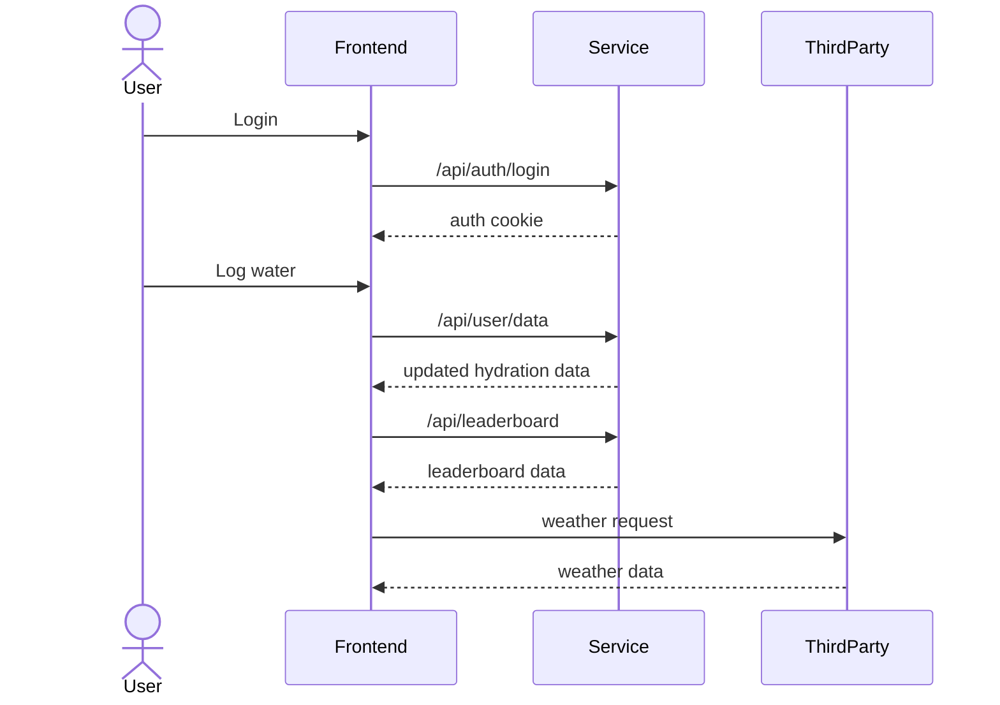

# Drinkly

[My Notes](notes.md)

## &#128640; Specification Deliverable

For this deliverable I did the following. I checked the box `[x]` and added a description for things I completed.

- [x] Proper use of Markdown
- [x] A concise and compelling elevator pitch
- [x] Description of key features
- [x] Description of how you will use each technology
- [x] One or more rough sketches of your application. Images are embedded in this file using Markdown image references.

### Elevator pitch

Drinkly is a hydration tracker that turns drinking water into a simple daily game. Users log water, build streaks, grow a virtual tree, and compare progress on a leaderboard.

### Design

```mermaid
sequenceDiagram
    actor User
    participant Frontend
    participant Service
    participant ThirdParty

    User->>Frontend: Login
    Frontend->>Service: /api/auth/login
    Service-->>Frontend: auth cookie
    User->>Frontend: Log water
    Frontend->>Service: /api/user/data
    Service-->>Frontend: updated hydration data
    Frontend->>Service: /api/leaderboard
    Service-->>Frontend: leaderboard data
    Frontend->>ThirdParty: weather request
    ThirdParty-->>Frontend: weather data
```

### Key features

- Register, login, and logout
- Log daily water intake
- Track streaks and weekly totals
- Show a virtual tree based on progress
- View a hydration leaderboard
- Show a weather reminder from a third-party API

### Technologies

I am going to use the required technologies in the following ways.

- **HTML** - Pages for login, dashboard, leaderboard, and about.
- **CSS** - Styling for layout, colors, spacing, and responsive design.
- **React** - Single page app with components, routing, and state.
- **Service** - Endpoints for register, login, logout, saving hydration data, loading hydration data, and getting the leaderboard.
- **DB/Login** - Stores users and hydration data. Passwords are hashed and protected endpoints require authentication.
- **WebSocket** - Friend activity is mocked for now and will later be replaced by live updates.
- **Third-party API** - The dashboard calls the Open-Meteo API and shows the current weather with a hydration reminder.

## &#128640; AWS deliverable

For this deliverable I did the following. I checked the box `[x]` and added a description for things I completed.

- [x] **Server deployed and accessible with custom domain name** - [My server link](https://startup.drink-ly.com).

## &#128640; HTML deliverable

For this deliverable I did the following. I checked the box `[x]` and added a description for things I completed.

- [x] **HTML pages** - Four HTML pages: `index.html`, `dashboard.html`, `leaderboard.html`, and `about.html`.
- [x] **Proper HTML element usage** - Used semantic elements like `header`, `nav`, `main`, `footer`, `form`, `input`, `button`, and `table`.
- [x] **Links** - Added navigation links between pages.
- [x] **Text** - Added descriptive text on each page.
- [x] **3rd party API placeholder** - Added a placeholder area for outside data.
- [x] **Images** - Added images and placeholders for the hydration tree.
- [x] **Login placeholder** - Added login inputs and buttons.
- [x] **DB data placeholder** - Added placeholder leaderboard data.
- [x] **WebSocket placeholder** - Added placeholder friend activity.

## &#128640; CSS deliverable

For this deliverable I did the following. I checked the box `[x]` and added a description for things I completed.

- [x] **Visually appealing colors and layout. No overflowing elements.** - Used a blue theme and responsive layout.
- [x] **Use of a CSS framework** - Used Bootstrap for layout and components.
- [x] **All visual elements styled using CSS** - Styled navigation, cards, buttons, tables, and forms.
- [x] **Responsive to window resizing using flexbox and/or grid display** - Used flexbox, grid, and media queries.
- [x] **Use of a imported font** - Used a Google font.
- [x] **Use of different types of selectors including element, class, ID, and pseudo selectors** - Used several selector types in the CSS files.

## &#128640; React part 1: Routing deliverable

For this deliverable I did the following. I checked the box `[x]` and added a description for things I completed.

- [x] **Bundled using Vite** - Configured Vite for local development and builds.
- [x] **Components** - Created React components for Login, Dashboard, Leaderboard, and About.
- [x] **Router** - Used React Router for `/`, `/dashboard`, `/leaderboard`, and `/about`.

## &#128640; React part 2: Reactivity deliverable

For this deliverable I did the following. I checked the box `[x]` and added a description for things I completed.

- [x] **All functionality implemented or mocked out** - Used state and mocked activity to make the app feel interactive.
- [x] **Hooks** - Used `useState` and `useEffect` for data loading and UI updates.

## &#128640; Service deliverable

For this deliverable I did the following. I checked the box `[x]` and added a description for things I completed.

- [x] **Node.js/Express HTTP service** - I created an Express service in `service/index.js` and set the default port to `4000`.
- [x] **Static middleware for frontend** - The service uses `express.static('public')` to host the built frontend.
- [x] **Calls to third party endpoints** - The dashboard calls the Open-Meteo weather API from the frontend.
- [x] **Backend service endpoints** - I added endpoints for auth, user hydration data, and the leaderboard.
- [x] **Frontend calls service endpoints** - The React app uses `fetch` to call login, create account, logout, load user data, save user data, and load leaderboard data.
- [x] **Supports registration, login, logout, and restricted endpoint** - The app supports account creation, login, logout, and protected routes that require a valid auth token.
- [x] **Uses BCrypt to hash passwords** - Passwords are hashed with `bcryptjs` before they are stored.

## &#128640; DB deliverable

For this deliverable I did the following. I checked the box `[x]` and added a description for things I completed.

- [ ] **Stores data in MongoDB** - I did not complete this part of the deliverable.
- [ ] **Stores credentials in MongoDB** - I did not complete this part of the deliverable.

## &#128640; WebSocket deliverable

For this deliverable I did the following. I checked the box `[x]` and added a description for things I completed.

- [ ] **Backend listens for WebSocket connection** - I did not complete this part of the deliverable.
- [ ] **Frontend makes WebSocket connection** - I did not complete this part of the deliverable.
- [ ] **Data sent over WebSocket connection** - I did not complete this part of the deliverable.
- [ ] **WebSocket data displayed** - I did not complete this part of the deliverable.
- [ ] **Application is fully functional** - I did not complete this part of the deliverable.
